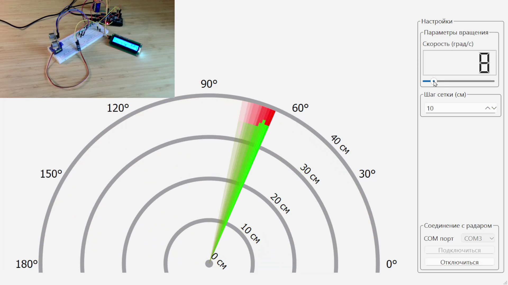

# Радар на базе микроконтроллера MIK32 Амур

Приложение состоит из двух частей:

- Сама прошивка для микроконтроллера
- Графическое приложение на Qt, предназначенное для приема данных с контроллера и отрисовки радара, передачи ему команд

## Стек используемых технологий

- Работа с сервоприводом через ШИМ
- Разработана библиотека для поддержкой дальномера HC-SR04
- Для работы с GPIO применяется HAL
- Работа с дисплеем по протоколу I2C (использована сторонняя библиотека)
- Взаимодействие с ПК по UART
- Обработка команд от ПК через прерывания

## Демонстрация работы проекта

